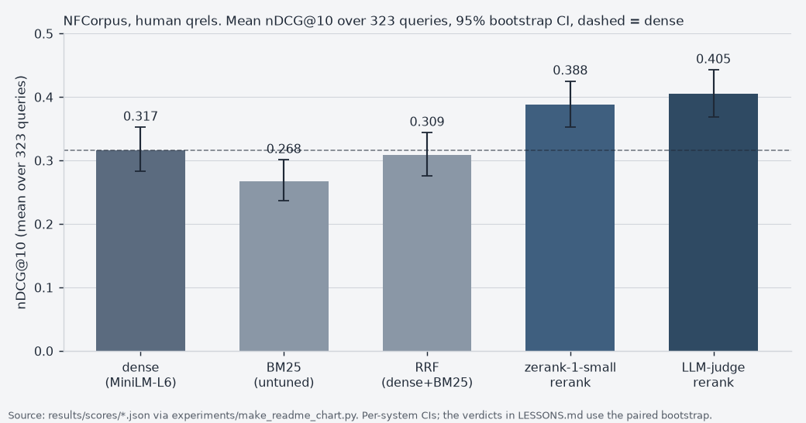

# rag-retrieval-lab


%2C%20323%20queries-3f5f7f)


**Retrieval methods, explained by running them — predictions written down first.**
**The case with receipts (frozen write-up): [`SHOWCASE.md`](SHOWCASE.md).**

Every RAG tutorial shows you hybrid search, RRF fusion, and an LLM reranker, then tells
you they help. This repo runs each one on a real benchmark and reports what actually
moved — including when the answer is "nothing."

Built from experiments originally run on a production investor-matching system, re-run
here on [NFCorpus](https://huggingface.co/datasets/BeIR/nfcorpus) so you can execute
every claim yourself.



## Results

Recomputed from the committed per-query score files (`results/scores/*.json`, 323
queries, human qrels) by `experiments/make_readme_chart.py`; the same numbers are in
[`LESSONS.md`](LESSONS.md). Deltas are paired bootstrap against the dense baseline,
10,000 resamples, 95% CI.

| method | nDCG@10 | Δ vs dense (95% CI) | recall@10 | recall@50 |
|---|---|---|---|---|
| dense (MiniLM-L6, title+text) | 0.3167 | baseline | 0.1550 | 0.2508 |
| BM25 (untuned, see note) | 0.2678 | −0.049 (−0.071 to −0.027), p ≈ 0 | 0.1241 | 0.1792 |
| RRF (dense + BM25) | 0.3093 | −0.007 (−0.024 to +0.009), null | 0.1477 | 0.2521 |
| zerank-1-small rerank of the dense top-50 | 0.3881 | +0.071 (+0.055 to +0.089), p ≈ 0 | 0.1819 | 0.2508 |
| LLM-judge rerank of the dense top-50 | **0.4052** | +0.089 (+0.072 to +0.106), p ≈ 0 | 0.1865 | 0.2508 |

Note on BM25: the index is built with `.lower().split()`, no stemming and no stopword
list (`ragexp/retrieve.py`). The 0.2678 is a ceiling for that preprocessing, not a
verdict on BM25. Note on recall@50: the two rerankers permute the dense top-50, so their
recall@50 is identical to dense by construction; recall@10 moves because the reranker
changes which of those 50 reach the top-10.

---

## The rule: predict first, then run

Every notebook **states its prediction and the mechanism behind it before running the
experiment.** Then it runs and reports what happened, including when the prediction was
wrong. That's the whole method — a prediction you write down afterwards isn't a
prediction, it's a story.

This matters because the source system's results **do not automatically transfer.** It
ran on 1,147 investor profiles with a specific lexical field; NFCorpus is bio-medical
abstracts. Some mechanisms carry over, some don't, and the difference is the lesson:

- **A mechanism that should transfer.** If your query and your document are embedded by
  the *same model*, they already live in the same space. An adapter exists to fix
  cross-space misalignment — there isn't any, so training one can't help. That argument
  doesn't mention the corpus, so it should hold here. (Notebook 05 — prediction: null)
- **A result that probably won't transfer.** RRF fusion *hurt* recall on the source
  system. But BM25 is strong on domain-specific terminology, which is exactly what
  NFCorpus is made of, and RRF is widely reported to help on BEIR-type data. The
  original null may have been a fact about that corpus, not about RRF. (Notebook 03 —
  prediction: genuinely unsure, and that's the honest answer)

The predictions for notebooks 03 and 04 have now **resolved** — the notebooks carry
the numbers and the readings. Notebooks 05 and 06's predictions are still open.

## The dataset

**NFCorpus** — BEIR's bio-medical retrieval set. Chosen deliberately:

| property | value | why it matters |
|---|---|---|
| corpus | 3,633 docs | embeds in <1 min on a laptop — every notebook re-runs from scratch |
| queries | 323 (judged) | enough for a paired bootstrap to say something |
| judgments | 12,334 (~38/query) | densely judged; you can tell "not retrieved" from "not judged" |
| grades | 1 and 2 (+ implicit 0) | **graded, not binary** — nDCG and learning-to-rank need this |
| doc structure | `title` + `text` | lets notebook 05 ask summary-vs-body, the real RAG question |

Most BEIR sets are binary. SciFact ships 339 judgments *all scored 1* — nDCG degenerates
and LTR is impossible. Picking the dataset is part of the method, so it gets a table.

## Notebooks

Each one: a concept, a **prediction with a mechanism**, an experiment, and whatever
actually happened. In order.

| # | Notebook | Concept | Prediction (as pre-registered) | Outcome |
|---|---|---|---|---|
| 01 | `the-ruler` | recall@k, nDCG@k, paired bootstrap | *No prediction — this builds the instrument.* Shows why undefined must be `None` not `0.0`, and why two overlapping CIs don't mean "no difference" | ✅ run — both demos land (zero-poisoning understates 40%; paired p≈0 where independent CIs overlap) |
| 02 | `dense-baseline` | embed, rank by cosine | *No prediction — this is the bar.* | ✅ run — nDCG@10 0.317; per-query scores committed |
| 03 | `lexical-and-fusion` | BM25, Reciprocal Rank Fusion | **Unsure.** Hurt on the source system; BM25 should be strong on bio-medical terminology, so it may help here. Genuinely open | **Resolved:** BM25 loses to dense everywhere (with the caveat that BM25 here is untuned: `.lower().split()`, no stemming or stopwords, so this is a preprocessing ceiling, not a verdict on BM25); **RRF nulls vs dense**, the source system's null transferred. Fusion only beats the weaker parent |
| 04 | `reranking` | LLM reranker, off-the-shelf reranker | **nDCG rises, recall@50 doesn't move.** Reranking permutes a fixed 50-doc pool, so it cannot change which docs are in the pool. recall@10 can move, because reranking changes which pool docs reach the top-10 | **Held, both halves:** nDCG@10 0.317→0.405 (LLM, p≈0) / 0.388 (zerank); recall@50 frozen bit-for-bit at 0.2508; recall@10 moved +0.032 (LLM) / +0.027 (zerank). Bonus: judge grading its own homework scores a meaningless 1.0 |
| 05 | `pooling-vs-summary` | title-embed vs chunk-pooling; trained adapter | **Pooling helps** (the body carries signal the title doesn't). **Adapter nulls** — same encoder, nothing to align | ⬜ open |
| 06 | `learning-to-rank` | XGBoost / LambdaMART on MSLR-WEB10K | **LambdaMART wins.** MSLR is LTR's home benchmark. A published null exists ([Elsevier](https://github.com/elsevierlabs-os/build-ltr-models-using-llm)) but that was LLM-generated labels on a different corpus — worth testing whether the difference is the labels | ⬜ open |

### The thread running through all of them

**Notebook 04 is the spine.** If an LLM writes your relevance labels *and* an LLM
reranks your results, and the score goes up — did the system improve, or did the judge
agree with itself?

The answer isn't a better prompt. It's finding a measurement the optimizer *cannot*
game. Reranking only reorders a fixed candidate pool, so it cannot change which
documents are in the pool. **recall at the pool depth (recall@50 here) is therefore
immune to reranker self-agreement.** recall@10 is not: reranking changes which pool
docs reach the top-10, and it did move (+0.032 for the LLM judge). Any movement in
recall@50 has to come from somewhere real, or from a bug.

That idea — find a measurement the thing being tested can't influence — is the whole
repo, and it generalises well past retrieval.

## Setup

```bash
pyenv virtualenv 3.12.9 rag-retrieval-lab && pyenv local rag-retrieval-lab
pip install -r requirements.txt
python -c "from ragexp.data import load_nfcorpus; print(load_nfcorpus().summary())"
# NFCorpus: 3633 docs, 323 queries, 12334 judgments (38.2/query), grade distribution {1: 11758, 2: 576}
```

No notebook needs an API key. Notebook 04's LLM judge ran through headless Claude Code
(`claude -p`, subscription login, see `ragexp/rerank.py`), and its grades are committed to
`results/rerank/`, so everything downstream reproduces without re-running it.

Provenance of the judge row: the grades were committed on 2026-08-15 and came through the
CLI's `opus` alias (Claude Opus; the exact model version behind the alias was not
recorded). The 0.4052 figure reproduces from the committed grades; the grades themselves
cannot be regenerated against the same model, since the alias moves. The zerank row can
be re-run locally against the named checkpoint `zeroentropy/zerank-1-small` (not
revision-pinned).

## Layout

```
ragexp/          the library — importable, unit-testable, no notebook magic
  metrics.py     recall@k, nDCG@k, paired bootstrap        [done]
  data.py        NFCorpus loader                            [done]
  embed.py       sentence-transformers wrapper              [done]
  retrieve.py    dense / bm25 / rrf / pooling               [done]
  runs.py        per-query scoring + committed score files  [done]
  rerank.py      LLM judge + off-the-shelf reranker         [done]
notebooks/       the teaching layer — narrative, plots, lessons (01–04 done)
experiments/     scripts that produce the committed numbers
results/         committed snapshots (so notebooks don't need to re-run everything)
tests/           pytest suite (46 tests; `-m integration` needs local HF caches)
LESSONS.md       every experiment: what / number / verdict / lesson  [done]
```

Logic lives in `ragexp/`, not in notebook cells. Notebooks import it. That way the
claims are testable and the notebooks stay readable.

## Status

Notebooks 01–04 — the stop-and-ship artifact — are done: library tested, notebooks
executed with outputs committed, and both open predictions resolved (03: RRF nulls
against dense; 04: nDCG rises while recall@50 stays frozen, as it structurally must).
Notebook 04's LLM-judge grades and zerank scores are committed under
`results/rerank/`, so everything reproduces without an API key or a GPU.

Remaining: notebooks 05–06 (optional depth). `LESSONS.md` and the predictions→results table are in place.
